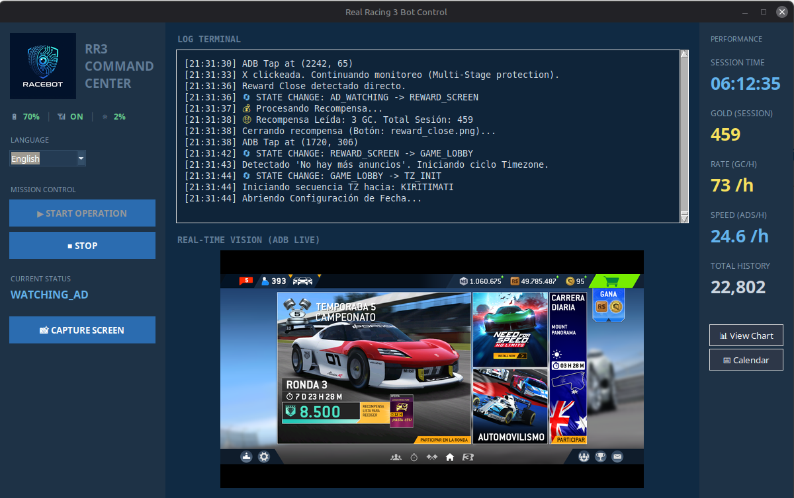
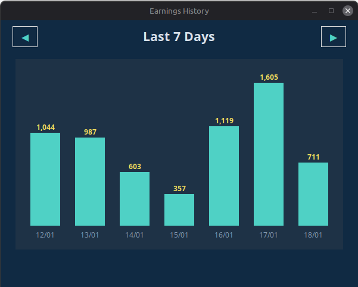
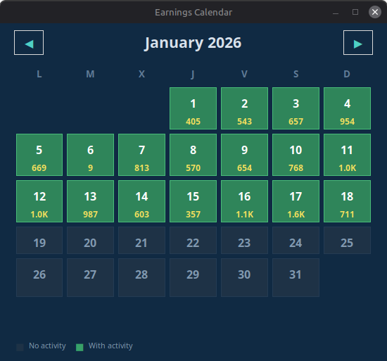

<div align="center">

# 🏎️ RR3 Bot Lite

### *Why waste hours watching ads when a bot can do it for you?*

[](https://python.org)
[](LICENSE)
[]()

**Automate your Real Racing 3 gold farming while you do literally anything else.**

[English](#-features) • [Español](#-características)




</div>

---

## 🚀 What is this?

RR3 Bot Lite is an automation tool that **watches ads for you** in Real Racing 3, collecting gold coins 24/7. It uses computer vision to detect buttons, handle pop-ups, and even switch timezones automatically to maximize your earnings.

### Why use it?
- 💰 **Earn gold while sleeping** - Let the bot farm overnight
- 🎯 **Smart detection** - Handles ads, surveys, and edge cases
- 🌍 **Timezone exploit** - Automatically switches zones for unlimited ads
- 📊 **Real-time stats** - Track your earnings with beautiful charts
- 🌐 **Multi-language** - Interface in 5 languages (EN, ES, FR, DE, IT)

---

## 🎯 Features

| Feature | Status |
|---------|--------|
| Automatic ad watching | ✅ |
| Gold coin detection | ✅ |
| Button & UI recognition | ✅ |
| Timezone auto-switch | ✅ |
| Real-time statistics | ✅ |
| Historical earnings log | ✅ |
| Calendar & charts | ✅ |
| Multi-language UI | ✅ |
| ML/AI components | ❌ (lite version) |

---

## 📦 Quick Start

### Prerequisites
- Python 3.10+
- Tesseract OCR
- Android device with USB debugging enabled

> **Note:** ADB is automatically managed by the `adbutils` library.

### Windows - Tesseract Installation
1. Download installer from [UB-Mannheim/tesseract](https://github.com/UB-Mannheim/tesseract/wiki)
2. Run installer (default path: `C:\Program Files\Tesseract-OCR`)
3. Add to PATH: `System Properties → Environment Variables → Path → Add: C:\Program Files\Tesseract-OCR`
4. Verify: `tesseract --version` in CMD

### Linux
```bash
sudo apt install tesseract-ocr  # Ubuntu/Debian
chmod +x run.sh
./run.sh
```

### Windows - Build
```cmd
build.bat
```

📖 **Full documentation:** [instructions.md](instructions.md) (EN) | [instrucciones.md](instrucciones.md) (ES)

---

## 📸 Screenshots

<details>
<summary>Click to expand</summary>

*Coming soon...*

</details>

---

## ⚠️ Disclaimer

This tool is for **educational purposes only**. Use at your own risk. The developers are not responsible for any bans or account actions taken by EA/Firemonkeys.

---

<div align="center">

## ⭐ Star History

*If this bot saved you time, consider leaving a star!*

---

Made with ☕ and frustration with ads

</div>

---

# 🇪🇸 Español

## 🚀 ¿Qué es esto?

RR3 Bot Lite es una herramienta de automatización que **ve anuncios por ti** en Real Racing 3, recolectando monedas de oro 24/7. Usa visión por computadora para detectar botones, manejar pop-ups, e incluso cambiar zonas horarias automáticamente para maximizar tus ganancias.

### ¿Por qué usarlo?
- 💰 **Gana oro mientras duermes** - Deja que el bot farmee toda la noche
- 🎯 **Detección inteligente** - Maneja anuncios, encuestas y casos especiales
- 🌍 **Exploit de zona horaria** - Cambia zonas automáticamente para anuncios ilimitados
- 📊 **Estadísticas en tiempo real** - Rastrea tus ganancias con gráficos bonitos
- 🌐 **Multi-idioma** - Interfaz en 5 idiomas (EN, ES, FR, DE, IT)

---

## 🎯 Características

| Característica | Estado |
|----------------|--------|
| Ver anuncios automáticamente | ✅ |
| Detección de monedas de oro | ✅ |
| Reconocimiento de botones | ✅ |
| Cambio automático de zona horaria | ✅ |
| Estadísticas en tiempo real | ✅ |
| Registro histórico de ganancias | ✅ |
| Calendario y gráficos | ✅ |
| Interfaz multi-idioma | ✅ |
| Componentes ML/AI | ❌ (versión lite) |

---

## 📦 Inicio Rápido

### Requisitos
- Python 3.10+
- Tesseract OCR
- Dispositivo Android con depuración USB habilitada

> **Nota:** ADB se gestiona automáticamente por la librería `adbutils`.

### Windows - Instalación de Tesseract
1. Descarga el instalador de [UB-Mannheim/tesseract](https://github.com/UB-Mannheim/tesseract/wiki)
2. Ejecuta el instalador (ruta por defecto: `C:\Program Files\Tesseract-OCR`)
3. Añade al PATH: `Propiedades del Sistema → Variables de Entorno → Path → Añadir: C:\Program Files\Tesseract-OCR`
4. Verifica: `tesseract --version` en CMD

### Linux
```bash
sudo apt install tesseract-ocr  # Ubuntu/Debian
chmod +x run.sh
./run.sh
```

### Windows - Compilar
```cmd
build.bat
```

📖 **Documentación completa:** [instructions.md](instructions.md) (EN) | [instrucciones.md](instrucciones.md) (ES)

---

## ⚠️ Aviso Legal

Esta herramienta es solo para **propósitos educativos**. Úsala bajo tu propio riesgo. Los desarrolladores no son responsables de ningún ban o acción tomada por EA/Firemonkeys.
